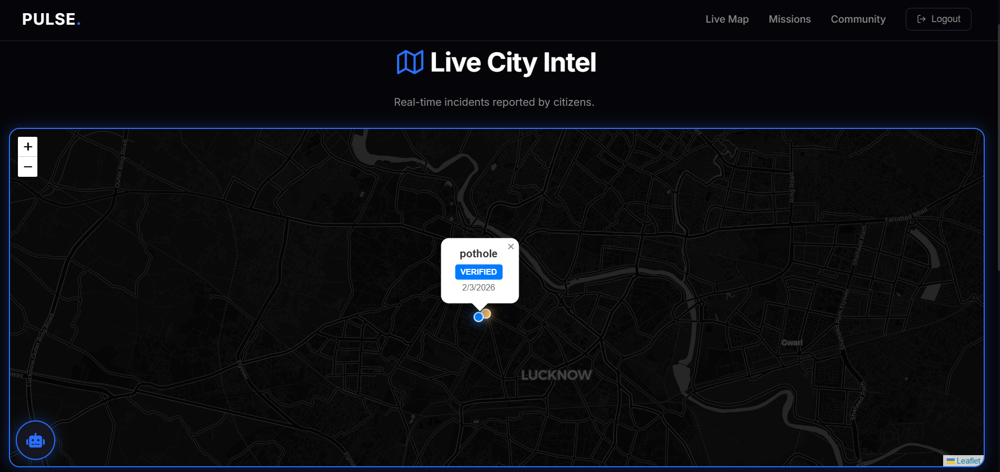
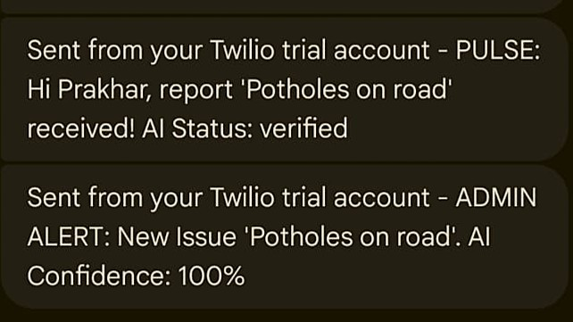

# PULSE V2 — Frontend

PULSE is an AI-assisted civic engagement platform that combines issue reporting, AI verification, gamification, and community participation to improve local civic problem resolution.

This repository contains the React frontend for the platform, providing the user interface for issue reporting, mission participation, community engagement, and administrative workflows. It communicates with the PULSE Django REST backend to manage authentication, report processing, AI-assisted verification, and user progression.

The project was built with significant AI assistance. The developer was responsible for project ideation, feature planning, workflow design, testing, debugging, deployment, and iterative refinement. The AI-assisted development process is documented in a dedicated section below.

---

## Highlights

- AI-assisted image verification using Google Gemini
- Interactive map with geotagged issue reporting
- Gamification through XP, ranks, and missions
- Admin dashboard for report moderation
- JWT-based authentication
- Real-time issue tracking

---

## Demo

A complete walkthrough of the platform, including issue reporting, AI verification, missions, leaderboards, and administrative workflows, is available below.

[Watch the Demo Video](https://drive.google.com/file/d/1Tz8PmxmHxCmZ4qnJowaaoUKCz6cK0meq/view?usp=drive_link)

---

## Table of Contents

- [Overview](#overview)
- [Features](#features)
- [Tech Stack](#tech-stack)
- [Project Structure](#project-structure)
- [Screenshots](#screenshots)
- [Feature Demonstrations](#feature-demonstrations)
- [Getting Started](#getting-started)
- [Deployment](#deployment)
- [AI-Assisted Development](#ai-assisted-development)
- [Known Limitations](#known-limitations)
- [Related Repositories](#related-repositories)

---

## Overview

Cities accumulate small problems — potholes, broken streetlights, overflowing bins — that go unreported because the process of reporting them is too cumbersome. PULSE gives citizens a direct channel to flag these issues, track what happens to them, and stay informed about community activity in their area.

On the administration side, PULSE gives city officials a moderation dashboard to review reports, verify them, close them out, and communicate back to citizens.

The platform uses AI image verification to reduce the manual review burden. When a citizen uploads a photo of a civic issue, the AI cross-references the image against the description and assigns a confidence score. High-confidence reports are automatically verified. Everything else routes to a human reviewer.

---

## Features

### Public Access

- City-wide interactive map showing all active, verified, and resolved civic reports
- Public visibility into community-reported incidents and resolution progress, without requiring an account

### Authentication and Profiles

- User registration and login
- JWT-based session management
- Profile management including bio and contact information
- Personalized report history and activity log

### Citizen Dashboard

- Live geolocation map using Leaflet, centered on the user's current location
- AQI and local weather monitoring widgets
- Personal issue tracking with real-time status updates
- Detailed report history with case IDs, admin feedback, and proof-of-resolution images
- Flippable report cards that reveal resolution details on hover

### Civic Issue Reporting

- Categorised issue submission with written description and image upload
- Geotagging through a map-based location pin system
- AI-powered image analysis using Google Gemini
- Automated confidence scoring (0–100) with intelligent status routing
- Human-in-the-loop review for ambiguous or low-confidence submissions

### Gamification

- XP-based progression system tied to reporting and community participation
- Dynamic citizen rank tiers: Citizen, Scout, Guardian, Hero
- Community missions created by administrators, validated by AI
- Competitive leaderboard with weekly and monthly contributor recognition

### Community Features

- Administrative notice board for official announcements
- Pinned notices for time-sensitive updates
- Global map showing all reports across the platform
- AI-powered chatbot available across the platform to guide users

### Administration Portal

- Dedicated admin login and dashboard
- Civic report moderation with manual status override (Pending, Verified, Rejected, Resolved)
- AI transparency panel showing the AI's analysis and confidence score for each report
- Mission creation, editing, and manual approval workflows
- Notice board management and content publishing
- User activity monitoring

---

## Tech Stack

| Layer | Technology |
|---|---|
| Frontend Framework | React |
| Map Rendering | Leaflet |
| Authentication | JWT-based Authentication |
| AI Integration | Google Gemini API |
| Media Storage | Cloudinary |
| Deployment | Vercel |
| Backend | Django REST Framework (separate repository) |
| Database | PostgreSQL (managed by backend) |

---

## Project Structure

```
pulse-frontend/
├── Assets/
│   └── Screenshots/
├── public/
├── src/
│   ├── components/
│   ├── pages/
│   ├── services/
│   ├── styles/
│   ├── App.js
│   └── index.js
├── package.json
├── vercel.json
└── README.md
```

---

## Screenshots

### User Experience

#### Landing Page


#### Authentication


#### Citizen Dashboard


---

### Civic Reporting Workflow

#### Report Submission


#### Submission History


#### Live Civic Map



---

### Community & Gamification

#### Missions and Leaderboards


#### Community Notice Board


---

## Feature Demonstrations

### SMS Notifications (Twilio)

PULSE integrates Twilio to send SMS notifications during the civic issue reporting workflow. During testing, the same phone number was used for both the citizen and administrator accounts, allowing both notifications to be captured in a single screenshot.

The screenshot below shows:

- A confirmation message sent to the citizen after successfully submitting a report.

- An administrative alert containing the reported issue and the AI confidence score



---


## Getting Started

### Prerequisites

- Node.js (v16 or above)
- npm or yarn
- The PULSE backend must be running. See the [backend repository](#related-repositories) for setup instructions.

### Installation

1. Clone the repository:

```bash
git clone https://github.com/Prakhar4real/PULSE-V2-Frontend.git
cd PULSE-V2-Frontend
```

2. Install dependencies:

```bash
npm install
```

3. Start the development server:

```bash
npm start
```

The application will be available at `http://localhost:3000`.

---


## Deployment

The frontend is deployed using Vercel.

To deploy your own instance:

1. Fork or clone the repository.
2. Connect the repository to a Vercel project.
3. Configure the backend API endpoint if required.
4. Deploy the application.

---

## AI-Assisted Development

This project was built with substantial AI assistance, primarily through Google Gemini. A significant portion of the implementation was developed through iterative AI-assisted workflows involving prompting, testing, debugging, and refinement.

The developer's contributions included:

- Product ideation and feature planning
- UI direction and workflow design
- Prompt engineering and iterative refinement
- Integration testing and debugging
- Deployment configuration and management

This disclosure is intentional. AI-assisted development is a legitimate and increasingly common approach to building software. The goal here is transparency about the process, not concealment of it.

---

## Known Limitations

- AI image verification depends on access to the Google Gemini API. On a free-tier API key, verification may fail under load or after quota limits are reached. A valid API key with sufficient quota is recommended for consistent results.
- The platform has not been load-tested for large-scale production use.
- Twilio SMS notifications require an active Twilio account with a verified number.

---

## Related Repositories

- [PULSE V2 Backend](https://github.com/Prakhar4real/PULSE-V2-Backend) — Django REST Framework API, PostgreSQL, and all server-side logic.